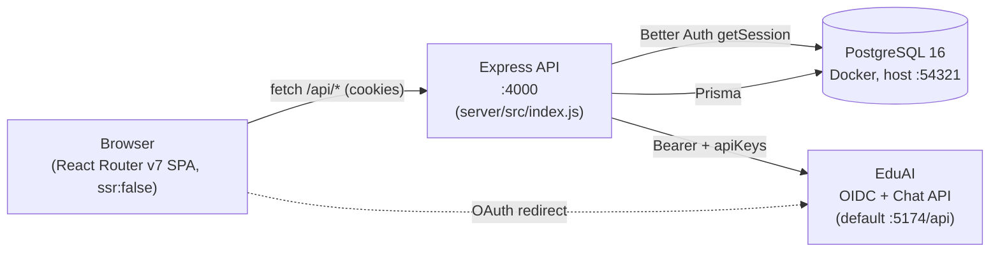
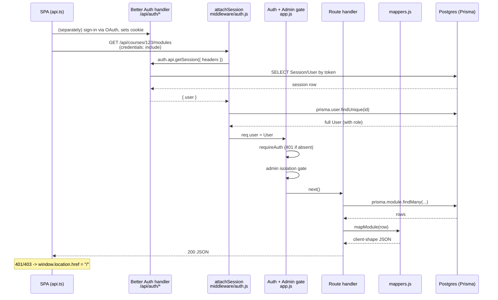
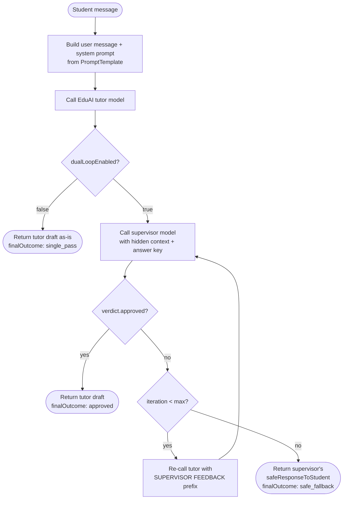
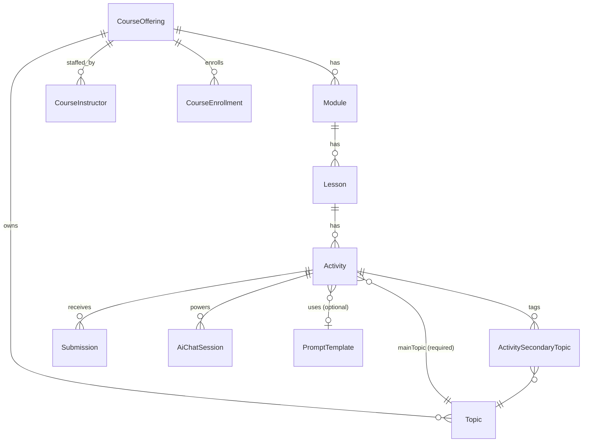

# AI Tutor — Architecture

This document describes the runtime architecture, request lifecycle, and the cross-cutting subsystems
that maintainers must understand before changing core code paths. For product-level / non-technical
context (user roles, features, workflows), see [`SYSTEM_OVERVIEW.md`](../SYSTEM_OVERVIEW.md).

> Inline code comments reference this document by stable section anchors. Renaming sections will
> break those references — prefer adding a new section over renaming an existing one.

---

## High-Level Topology

The platform is composed of four independent processes that communicate over HTTP. The frontend
is a static SPA; nothing about it is server-rendered.



| Component | Process | Source | Default Port |
|-----------|---------|--------|--------------|
| SPA       | Static assets served by Apache (prod) or `vite dev` | `app/` | `5173` (dev) |
| API       | Node/Express, single PM2 process `aitutor-api`     | `server/src/index.js` | `4000` |
| DB        | PostgreSQL 16-alpine in Docker                      | `docker-compose.yml` | `54321` host -> `5432` container |
| EduAI     | External service (auth + LLM proxy)                 | not in this repo | `5174` (dev) |

The Apache reverse proxy in production sits in front of API and serves the SPA build at the root.
See [`docs/DEPLOYMENT.md`](DEPLOYMENT.md) for the production layout.

---

## Provider Stack at App Root

The SPA's React tree is wrapped by three providers in this exact order at
[`app/root.tsx:91-101`](../app/root.tsx):

```tsx
<AuthProvider initialUser={null}>
  <BugReportProvider>
    <TourProvider>
      <Outlet />
    </TourProvider>
  </BugReportProvider>
</AuthProvider>
```

**Ordering is load-bearing.** Do not rearrange without understanding the dependencies:

| Provider | Source | Why this position |
|----------|--------|-------------------|
| `AuthProvider` | [`app/hooks/useLocalUser.tsx`](../app/hooks/useLocalUser.tsx) | Outermost. On mount it calls `GET /api/me` and exposes the session user via context. Every other provider and route loader assumes auth state is resolvable. |
| `BugReportProvider` | [`app/components/bug-report/BugReportProvider.tsx`](../app/components/bug-report/BugReportProvider.tsx) | Wraps the tour layer because `useBugReportCapture` monkey-patches `window.fetch` and `console.{log,warn,error}` on mount. It must be live before any user-facing flow (tours included) starts producing logs we may want to capture in a bug report. |
| `TourProvider` | [`app/components/TourProvider.tsx`](../app/components/TourProvider.tsx) | Innermost because it consumes `useLocation` / `useNavigate` and drives DOM-level highlighting via `driver.js`. It depends on the route subtree being mounted, and it surfaces UI on top of all other content. |

If `AuthProvider` is moved inside `BugReportProvider`, the patched `fetch` runs before the
auth bootstrap and can capture noise from unauthenticated `/api/me` calls in every bug report.
If `TourProvider` is moved outside the route tree, `useLocation` will throw.

---

## Request Lifecycle: Authenticated API Call

The flow below is what happens when the SPA calls something like
`api.modulesForCourse(123)` from [`app/lib/api.ts`](../app/lib/api.ts).



Key implementation details:

1. **Cookie in, user out.** The browser sends Better Auth's session cookie automatically because
   every `fetch` in `app/lib/api.ts` uses `credentials: 'include'` (see lines 25-32).
2. **`attachSession` re-reads the user from Postgres on every request.** It does *not* trust the
   role claim from the session — it calls `prisma.user.findUnique({ where: { id } })` so that role
   changes take effect immediately ([`server/src/middleware/auth.js:6-23`](../server/src/middleware/auth.js)).
3. **Two gates run in series in `createApp()`** ([`server/src/app.js:73-95`](../server/src/app.js)):
   - `requireAuth` 401s if `req.user` is null (skipped for `/api/health` and `/api/auth/*`).
   - The admin-isolation gate 403s admins for any path that is not `/api/me`, `/api/admin/*`,
     `/api/ai-models`, or `/api/ai-models/*`. Admins are intentionally fenced off from
     student/instructor data; this is enforced by `isAllowedAdminPath()` in `app.js:19-26`.
4. **Mappers are the contract.** All resource handlers shape rows through
   [`server/src/utils/mappers.js`](../server/src/utils/mappers.js) before responding. The SPA's
   typed wrappers in `app/lib/api.ts` and `app/lib/types.ts` mirror those shapes; see
   [Frontend↔Backend Coupling Seams](#frontendbackend-coupling-seams).
5. **Frontend short-circuits 401/403.** `http()` in `app/lib/api.ts:34-46` redirects to `/` on
   401 or 403 unless already there, then throws so callers don't continue.

---

## Authentication Flow

AI Tutor uses **Better Auth session cookies**. There is no JWT, no `Authorization: Bearer` header
from the SPA, and no token storage in `localStorage`. The legacy "useLocalUser" name is historical;
that hook now just wraps the cookie-backed session.

### Identity provider: EduAI

EduAI is an external service that hosts an OIDC provider plus the LLM proxy used by the dual-loop
tutor. Better Auth is configured with the
[`genericOAuth`](https://better-auth.com/docs/plugins/generic-oauth) plugin pointing at EduAI's
discovery URL ([`server/src/auth.js:72-109`](../server/src/auth.js)).

| Setting | Source | Default |
|---------|--------|---------|
| Discovery URL | `EDUAI_DISCOVERY_URL` | `http://localhost:5174/api/auth/.well-known/openid-configuration` |
| Userinfo URL  | `EDUAI_USERINFO_URL`  | `http://localhost:5174/api/auth/oauth2/userinfo` |
| Client ID     | `EDUAI_CLIENT_ID`     | `aitutor-local` |
| Client secret | `EDUAI_CLIENT_SECRET` | `aitutor-local-secret` |
| Scopes        | (hardcoded)           | `openid profile email offline_access` |
| PKCE          | (hardcoded)           | enabled, with issuer validation |

### Role mapping

EduAI returns the user's role inside a namespaced claim, `https://eduai.app/role`. The custom
`getUserInfo` callback in `auth.js` reads that claim and normalizes it via `normalizeEduAiRole()`
([`auth.js:25-30`](../server/src/auth.js)) onto the local Prisma `Role` enum:

| EduAI claim value | Local `Role` |
|-------------------|--------------|
| `ADMIN`           | `ADMIN`      |
| `PROFESSOR`       | `PROFESSOR`  |
| `TA`              | `TA`         |
| anything else / missing | `STUDENT` |

### Account linking

`accountLinking.trustedProviders: ['eduai']` ([`auth.js:60-64`](../server/src/auth.js)) means the
first time a user signs in via EduAI, Better Auth will *automatically link* the OIDC account to
any existing local `User` row matching that email — no email-verification handshake. The
`updateUserInfoOnLink: true` flag also lets EduAI overwrite name/picture on link. Treat any
change to this block as security-sensitive.

### Trusted origins

The Better Auth handler accepts cross-origin auth callbacks only from
`http://localhost:5173` and `https://aitutor.ok.ubc.ca`
([`auth.js:38`](../server/src/auth.js)). New deployment domains must be added here.

---

## AI Dual-Loop Architecture

Located in [`server/src/services/aiGuidance.js`](../server/src/services/aiGuidance.js). Three
exported entry points (`generateTeachResponse`, `generateGuideResponse`, `generateCustomResponse`)
all funnel through `generateWithSupervisor()` -> `supervisedGenerate()`.

### The loop



### Modes

Each mode maps 1:1 to a `PromptTemplate.slug`:

| Mode (API) | Endpoint | Prompt template slug | Purpose |
|------------|----------|----------------------|---------|
| `teach`    | `POST /api/activities/:id/teach`  | `learning-prompt`   | Open-ended explanation around a topic. |
| `guide`    | `POST /api/activities/:id/guide`  | `exercise-prompt`   | Socratic hints for a specific question (uses `config.question/options/answer`). |
| `custom`   | `POST /api/activities/:id/custom` | (uses `activity.customPrompt` directly) | Per-activity instructor-authored prompt. |

All three use the same supervisor flow. The supervisor itself is driven by a separate template
with slug `supervisor-prompt`, fetched in `callSupervisor()`
([`aiGuidance.js:124-197`](../server/src/services/aiGuidance.js)).

### Visible vs. hidden context

The supervisor receives **two** context blobs per turn:

- **VISIBLE STUDENT CONTEXT** — the same prompt the tutor saw.
- **HIDDEN REVIEW CONTEXT** — adds the student's `knowledgeLevel` and (for guide/custom) the
  formatted answer key from `config.answer` (`buildGuideSupervisorContexts`, `formatAnswerKey`).

This is how the supervisor can tell whether the tutor is "leaking" the answer without ever giving
the tutor the answer in its system prompt.

### Verdict shape and fallback

The supervisor must return JSON of the form `{ approved, reason, feedbackToTutor, safeResponseToStudent }`.
If parsing fails, `callSupervisor` retries once with an explicit "YOUR PREVIOUS RESPONSE WAS NOT
VALID JSON" hint, then gives up and returns a hardcoded conservative verdict marked
`parseFailed: true`.

When the iteration budget (`maxSupervisorIterations`, default 3) is exhausted without an approval,
the function returns the supervisor's `safeResponseToStudent` from the last verdict instead of the
tutor draft. The trace records `finalOutcome: 'safe_fallback'`.

### API key forwarding

The user's per-EduAI API key arrives in the request body as `apiKey` (validated by
[`shared/schemas/aiGuidance.js`](../shared/schemas/aiGuidance.js)) and is forwarded to EduAI as
`apiKeys[provider] = { apiKey, isEnabled: true }` in `callEduAI()`
([`aiGuidance.js:43-49`](../server/src/services/aiGuidance.js)). It is **never persisted** —
the only API key the server stores is the optional `EDUAI_API_KEY` system override (see below).

---

## Data Model Overview (Prisma)

Source of truth: [`server/prisma/schema.prisma`](../server/prisma/schema.prisma). This section
calls out the relationships and invariants that the rest of the codebase relies on.

### Course content tree



Notable invariants:

- **`CourseOffering.externalId` + `externalSource`** track imported courses (EduAI imports use
  `externalSource = 'eduai'`). Indexed on `externalId` for sync lookups.
- **`Activity.mainTopicId` is non-nullable.** Every activity must have exactly one main topic.
  Secondary topics are M:N via `ActivitySecondaryTopic`.
- **`Activity.config` is a free-form `Json` column** carrying `question`, `options`, `answer`,
  `hints`, and `questionType` (`MCQ` or `SHORT_TEXT`). Mappers normalize `options` to
  `{ choices: string[] }` on the wire even though the column may store a bare array.
- **Three per-activity mode flags** — `enableTeachMode`, `enableGuideMode`, `enableCustomMode` —
  control which `/teach|/guide|/custom` endpoints are available for that activity.
- **`Submission.attemptNumber`** is a simple monotonically-increasing per-student counter; rows
  are not overwritten on resubmit.
- **`AiChatSession` is unique on `[userId, activityId, mode]`.** A student gets exactly one
  persistent EduAI `chatId` per (activity, mode) combo. `AiInteractionTrace` rows belong to a
  session and store the full dual-loop trace JSON.

### System settings

`SystemSetting` is a flat key/value table. Two keys are in active use today
([`server/src/services/systemSettings.js`](../server/src/services/systemSettings.js)):

| Key | Used for |
|-----|----------|
| `EDUAI_API_KEY` | Server-wide EduAI API key override (admin UI). Falls back to `process.env.EDUAI_API_KEY` if unset. |
| `AI_MODEL_POLICY` | JSON blob describing the tutor/supervisor model policy and dual-loop defaults; managed via `/api/admin/settings/ai-model-policy`. |

### Better Auth tables

`User`, `Session`, `Account`, `Verification` are owned by Better Auth via the Prisma adapter. The
`User.role` column is added as an `additionalField` in `auth.js`. Do not reshape these tables
without consulting Better Auth's adapter expectations.

---

## Tour System Contract

Tours are powered by [driver.js](https://driverjs.com) and orchestrated by
[`app/components/TourProvider.tsx`](../app/components/TourProvider.tsx) plus the engine in
[`app/lib/tours/`](../app/lib/tours/).

The contract that route components must honor:

| Attribute | Purpose | Example |
|-----------|---------|---------|
| `data-tour="<step-id>"` | Marks an element as the target for a tour step. The step's `target` selector in `tour-definitions.ts` is `[data-tour="<step-id>"]`. | `<header data-tour="student-dashboard-header">` |
| `data-tour-route="<href>"` | On a "selectable" card, tells the engine which route to follow next when this card is highlighted. The engine reads it via `readRouteFromElement()` in [`tour-utils.ts:41-45`](../app/lib/tours/tour-utils.ts) and stores it in `selectedCourseRoute` / `selectedModuleRoute` / `selectedLessonRoute` on the session context. | `data-tour-route={`/student/courses/${course.id}`}` |

**Removing or renaming either attribute silently breaks the tour** — `waitForElement()` in
`tour-utils.ts` will time out after 4s and the step will be skipped via
`moveSessionAfterMissingTarget`. There is no compile-time guard. When you change a route
component that participates in a tour, grep for the existing `data-tour` value before deleting
markup.

Current consumers (non-exhaustive — run `grep -r 'data-tour' app/` for the full list):
`student.tsx`, `student.course.tsx`, `student.topic.tsx`, `student.list.tsx`,
`StudentAiChat.tsx`, `TourButton.tsx`.

---

## Bug Report Capture

Implementation: [`app/hooks/useBugReportCapture.ts`](../app/hooks/useBugReportCapture.ts),
mounted exactly once via `BugReportProvider`.

On mount the hook **monkey-patches global APIs**:

- `console.log`, `console.warn`, `console.error` — wrappers push entries onto a ring buffer
  (max 200), then call the original.
- `window.fetch` — wrapper times the request, snapshots request/response headers and bodies
  (response body via `response.clone().text()`), and pushes onto a network ring buffer
  (max 100). The original `fetch` is invoked unchanged so app behavior is unaffected.

On unmount the originals are restored from `originalsRef`. **Do not mount this provider more
than once** — `patchedRef` guards against a double-patch in the same render but does not protect
against multiple `BugReportProvider` instances.

Screenshots are produced by lazily importing `html2canvas` only when the user opens the bug-report
dialog (`captureScreenshot()` at lines 178-197). The result is cached for 5 seconds
(`SCREENSHOT_CACHE_WINDOW_MS = 5_000`) so reopening the dialog quickly does not re-render the page.

The dialog reads `consoleLogs`, `networkLogs`, and `screenshot` via `getCapturedData()` and posts
them to `POST /api/bug-reports` along with the page URL, user agent, and the
`courseOfferingId/moduleId/lessonId/activityId` context that route components have set on the
provider via `setContext()`.

---

## Frontend↔Backend Coupling Seams

These three seams are the most common source of "everything compiles but the page is blank"
bugs. There is **no shared TypeScript type generation** across the boundary; the contract is
maintained by hand.

### 1. `app/lib/api.ts` ↔ `server/src/utils/mappers.js`

The mappers in `mappers.js` define the JSON shape the server sends. The typed wrappers in
`app/lib/api.ts` and the TypeScript types in `app/lib/types.ts` must mirror those shapes by
hand. Adding a field to `mapActivity()` without updating `app/lib/types.ts` produces a silently
discarded field on the client; renaming one produces `undefined` reads with no compile error.

When you change a mapper:
1. Update the matching type in `app/lib/types.ts`.
2. Update the call site in `app/lib/api.ts` if the new field is part of a request payload.
3. Update any consumer that destructures the old shape.

### 2. `shared/schemas/aiGuidance.js` request schemas

The Zod schemas in [`shared/schemas/aiGuidance.js`](../shared/schemas/aiGuidance.js)
(`TeachRequestSchema`, `GuideRequestSchema`, `CustomRequestSchema`,
`ActivityFeedbackRequestSchema`) are imported by the server's activity routes for validation.
The frontend's `api.sendTeachMessage / sendGuideMessage / sendCustomMessage` payload shapes
in `app/lib/api.ts:229-277` must keep field names and types aligned. Renaming `apiKey` ->
`apiToken` on either side would 400 every AI request.

### 3. Tour DOM selectors

Covered above in [Tour System Contract](#tour-system-contract). Steps in
`app/lib/tours/tour-definitions.ts` reference DOM by `[data-tour="..."]` selectors. The
selectors are matched at runtime via `document.querySelector` — there is no static checking.
A grep for the step id before any markup change is the only safety net.

---

## Further Reading

- Product / feature overview: [`SYSTEM_OVERVIEW.md`](../SYSTEM_OVERVIEW.md)
- Deployment, PM2, Apache, Docker layout: [`docs/DEPLOYMENT.md`](DEPLOYMENT.md)
- Two-agent supervisor design notes: [`docs/two-agent-supervisor-system.md`](two-agent-supervisor-system.md)
- API endpoint reference: [`docs/api-reference.md`](api-reference.md)
- Contributor workflow + git hooks: [`../CONTRIBUTING.md`](../CONTRIBUTING.md)
